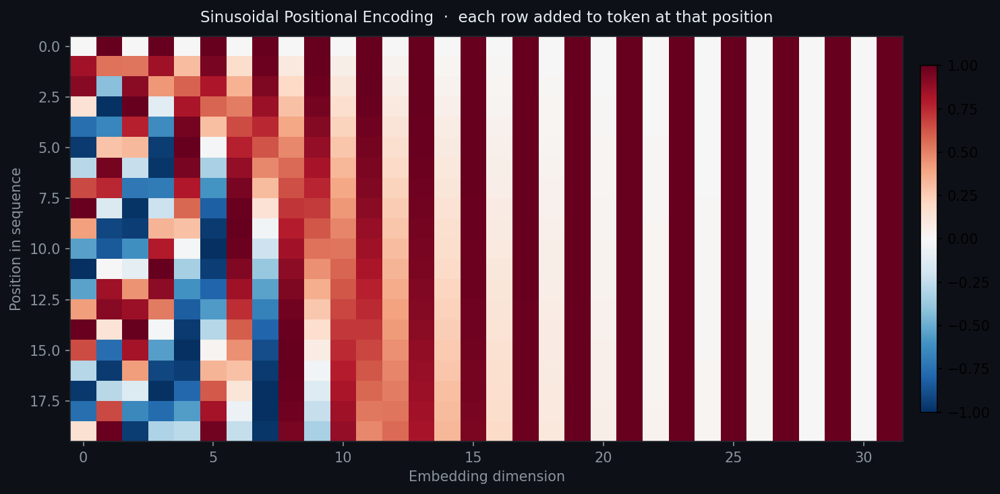
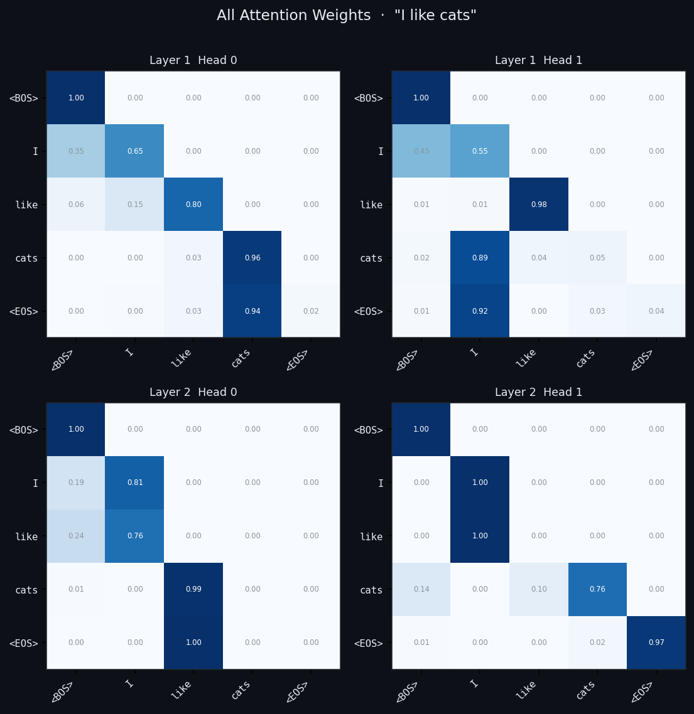
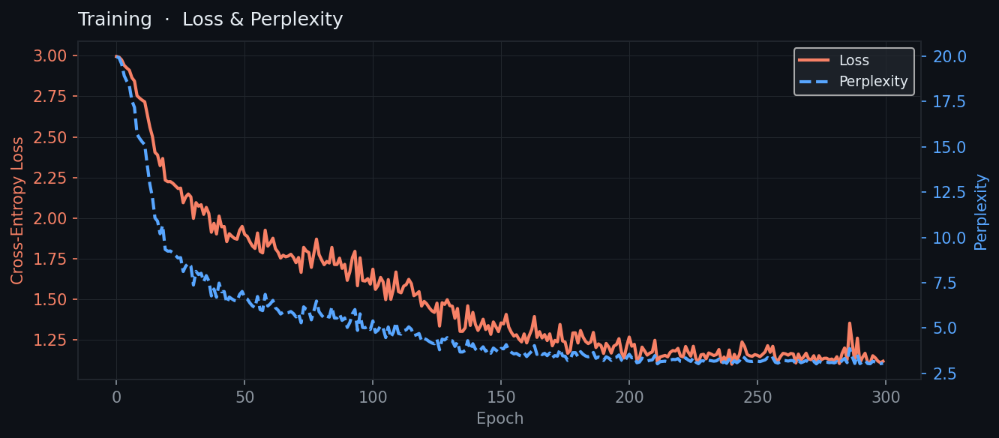
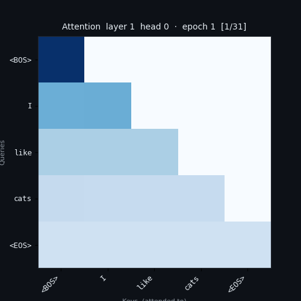

# mini-transformer

> A minimal GPT-style causal transformer built from scratch.
> Step 3 of the mini-LLM series.


---

## Series

| Step | Repository | What it builds |
|------|-----------|----------------|
| 1 | [mini-embedding](https://github.com/JeffreyRed/mini-embedding) | Word vectors — Skip-gram Word2Vec |
| 2 | [mini-self-attention](https://github.com/JeffreyRed/mini-self-attention) | Multi-head self-attention encoder block |
| **3** | **mini-transformer** ← you are here | Positional encoding + stacked causal decoder |
| 4 | [mini-gpt](https://github.com/JeffreyRed/mini-gpt) | Full next-token language model on real text |

> **Prerequisite:** familiarity with steps 1 and 2. Each repo is self-contained and runnable independently.

---

## What this adds over mini-self-attention

| Feature | mini-self-attention | mini-transformer |
|---|---|---|
| Positional encoding | ✗ | ✓ sinusoidal |
| Stacked layers | 1 block | 2 blocks |
| Causal mask | ✗ | ✓ upper-triangular |
| Special tokens | ✗ | ✓ `<BOS>` `<EOS>` `<PAD>` |
| Activation | ReLU | GELU |
| Weight tying | ✗ | ✓ embedding ↔ output |
| LR warmup | ✗ | ✓ linear warmup |
| Text generation | ✗ | ✓ greedy / temperature / top-k |
| Perplexity metric | ✗ | ✓ |

---

## Core concepts

### Positional encoding
Self-attention treats all positions equally — `"cats like I"` and `"I like cats"` look the same without positional information. We fix this by adding a unique sinusoidal vector to each token's embedding before the first block:

```
PE(pos, 2i)   = sin( pos / 10000^(2i / d_model) )
PE(pos, 2i+1) = cos( pos / 10000^(2i / d_model) )
```

These are fixed (not learned) and generalize to sequence lengths not seen during training.

### Causal mask
A triangular boolean mask prevents position `i` from attending to positions `i+1, i+2, ...`. This is what makes the model a *language model* — it can only use past context to predict the next token, matching how generation works at inference time.

```
Mask for seq_len=4:
         w0     w1     w2     w3
  w0  [ False,  True,  True,  True ]   w0 sees only itself
  w1  [ False, False,  True,  True ]   w1 sees w0, w1
  w2  [ False, False, False,  True ]   w2 sees w0, w1, w2
  w3  [ False, False, False, False]    w3 sees everything
```

### Stacked blocks
Two `TransformerBlock`s run in sequence. Each block takes the output of the previous one as input, allowing later layers to build on earlier representations. Layer 2's attention patterns are visibly different from Layer 1's — this is the "refinement" behaviour you can observe in `outputs/attention_all_layers.png`.

### Weight tying
The output projection (`Linear → vocab_size`) shares weights with the input embedding matrix. This reduces parameters and encourages the model to learn consistent representations between input and output space. Standard in GPT-2 and most modern LMs.

---

## Architecture

```
token indices  (batch, seq_len)
      │
      ▼
┌─────────────────────────────────────────┐
│  nn.Embedding   (vocab_size → emb_dim)  │
└─────────────────────────────────────────┘
      │
      ▼
┌─────────────────────────────────────────┐
│  PositionalEncoding  (sinusoidal, fixed)│
└─────────────────────────────────────────┘
      │
      ▼  ┌─ repeat N_LAYERS times ──────────────────────┐
         │                                              │
         │  ┌─────────────────────────────────────────┐ │
         │  │  LayerNorm                              │ │
         │  │  MultiHeadAttention  + causal mask      │ │
         │  │  + residual                             │ │
         │  └─────────────────────────────────────────┘ │
         │                                              │
         │  ┌─────────────────────────────────────────┐ │
         │  │  LayerNorm                              │ │
         │  │  FeedForward  (Linear → GELU → Linear)  │ │
         │  │  + residual                             │ │
         │  └─────────────────────────────────────────┘ │
         └──────────────────────────────────────────────┘
      │
      ▼
┌─────────────────────────────────────────┐
│  LayerNorm  (final)                     │
└─────────────────────────────────────────┘
      │
      ▼
┌─────────────────────────────────────────┐
│  Linear  (emb_dim → vocab_size)         │  ← weights tied to embedding
└─────────────────────────────────────────┘
      │
      ▼
  logits  (batch, seq_len, vocab_size)
```

---

## Project structure

```
mini-transformer/
│
├── data/
│   └── corpus.txt              # same corpus as mini-embedding
│
├── src/
│   ├── tokenizer.py            # vocab with BOS / EOS / PAD special tokens
│   ├── positional_encoding.py  # sinusoidal PE  ← new
│   ├── attention.py            # scaled dot-product + multi-head attention
│   ├── model.py                # TransformerBlock × N + generate()
│   ├── dataset.py              # CausalDataset with BOS/EOS wrapping
│   ├── train.py                # training loop with LR warmup + perplexity
│   ├── utils.py                # generate_text(), compare_layers(), inspection
│   └── visualize.py            # PE grid, all-layers heatmap, loss+PPL curve
│
├── outputs/                    # saved model + plots
├── main.py
├── environment.yml
├── requirements.txt
├── THEORY.md
└── README.md
```

---

## Quickstart

```bash
git clone https://github.com/your-username/mini-transformer.git
cd mini-transformer
conda env create -f environment.yml
conda activate mini-transformer
python main.py
```

---

## Configuration

| Parameter | Default | Notes |
|---|---|---|
| `EMB_DIM` | `32` | Larger than previous steps — gives cleaner PE visualisation |
| `N_HEADS` | `2` | Must divide `EMB_DIM` evenly |
| `N_LAYERS` | `2` | Stacked transformer blocks |
| `FF_DIM` | `64` | FeedForward inner dim (2 × EMB_DIM) |
| `EPOCHS` | `300` | More epochs needed with LR warmup |
| `LR` | `3e-3` | Peak learning rate after warmup |
| `WARMUP_STEPS` | `50` | Linear LR ramp-up duration |

---

## Outputs

| File | Description |
|---|---|
| `transformer.pt` | Saved model weights |
| `positional_encoding.png` | Sinusoidal PE matrix heatmap |
| `attention_all_layers.png` | All heads × all layers for `INSPECT_SENTENCE` |
| `loss_perplexity.png` | Training loss + perplexity on twin axes |
| `attention_animation.gif` | Layer 1, Head 0 attention evolving during training |






---

## Text generation

After training, `main.py` opens an interactive generation prompt:

```
  Prompt: I like

  → I like cats

  Prompt: I like --greedy
  Prompt: I hate --temp=0.5
  Prompt: dogs --topk=3
```

Flags: `--greedy`, `--temp=<float>`, `--topk=<int>`

---

## Deep dive

See [`THEORY.md`](./THEORY.md) for the full explanation of:
- Why positional encoding is necessary and how sinusoids encode position
- The causal mask — why it exists and how it is built
- Pre-norm vs post-norm residual connections
- GELU vs ReLU — what changes and why
- Weight tying
- LR warmup and why transformers need it
- Perplexity as a metric
- Line-by-line code walkthrough
- How this maps directly onto the GPT-2 architecture

---

## References

- Vaswani et al. (2017) — [Attention Is All You Need](https://arxiv.org/abs/1706.03762)
- Radford et al. (2019) — [GPT-2: Language Models are Unsupervised Multitask Learners](https://openai.com/research/language-unsupervised)
- [The Annotated Transformer](https://nlp.seas.harvard.edu/annotated-transformer/)

---

## License

MIT
